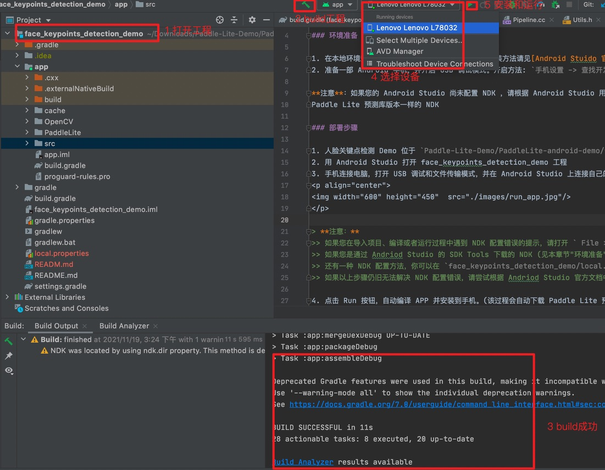
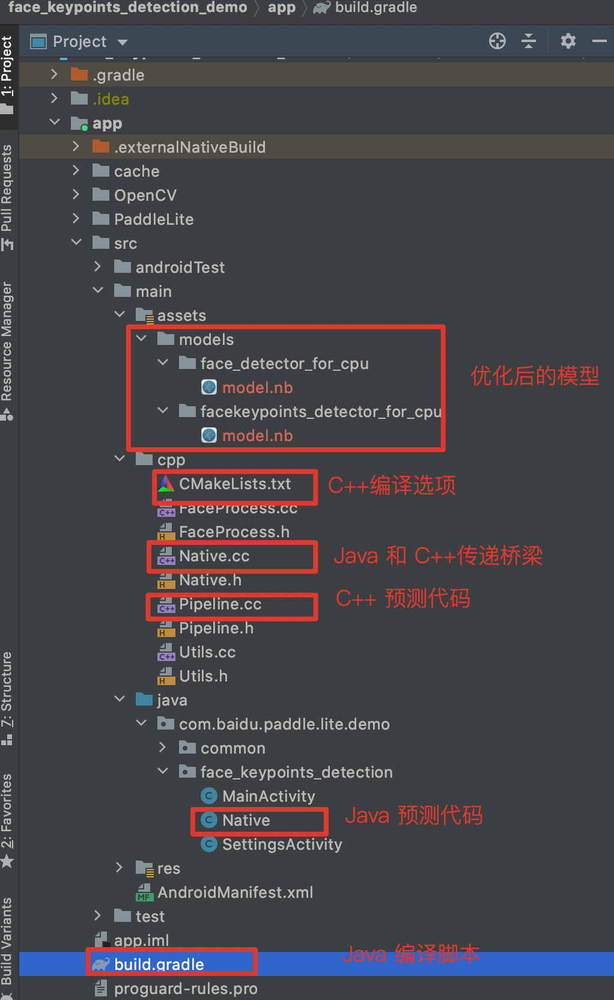
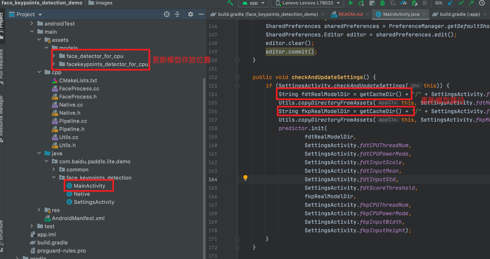
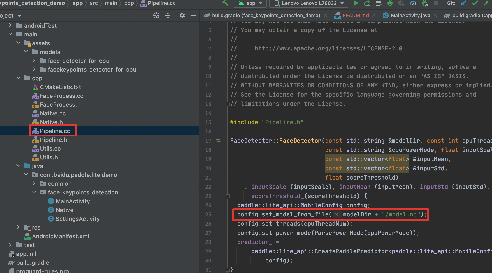
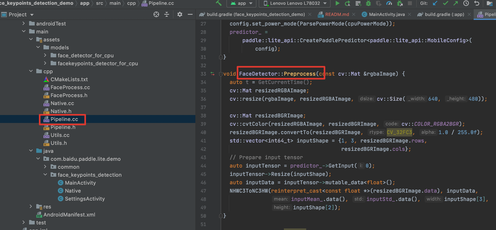
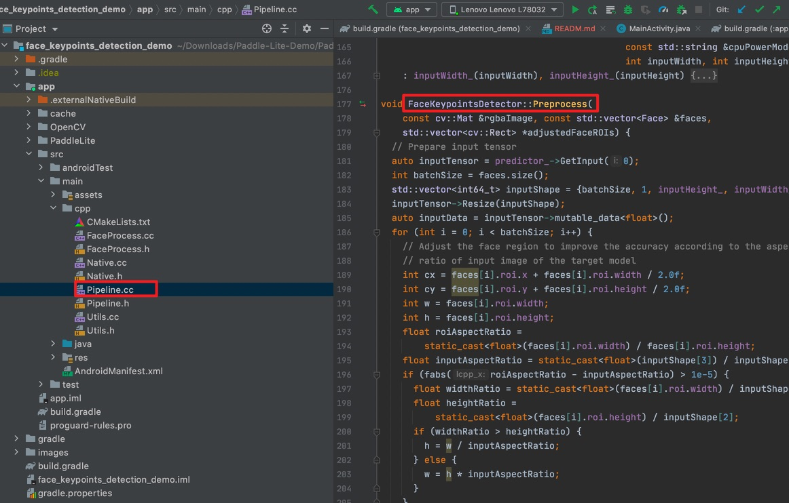
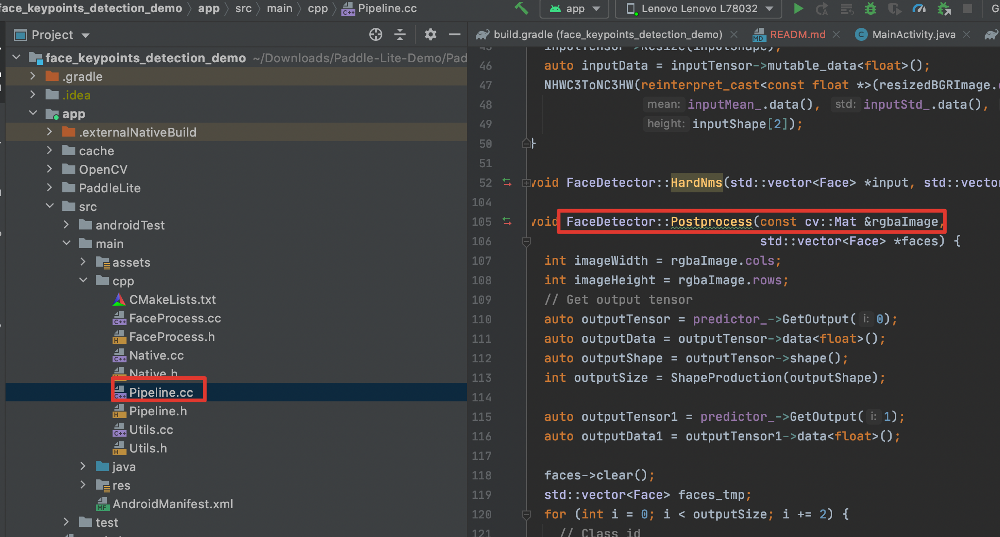
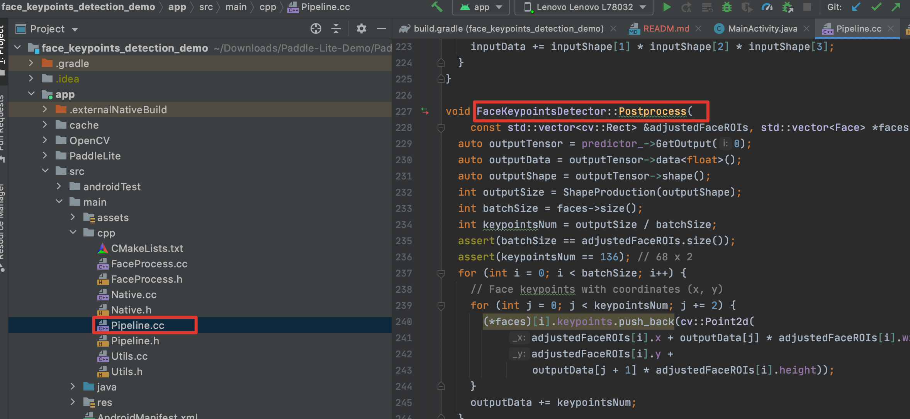

# 人脸关键点检测 C++ API Demo 使用指南
  在Android上实现实时的人脸关键点的检测功能，支持多人脸的关键点检测，支持如下功能：
  * 人脸框检测
  * 人脸关键点检测
  * 美妆特效
  
  另外，此Demo具有很好的易用性和开放性。如在demo中跑自己训练好的模型，新增美妆处理功能。
  本文将主要介绍人脸关键点检测 Demo 运行方法和如何在更新模型/输入/输出处理下，保证人脸关键点检测 demo 仍可继续运行。
  
## 如何运行人脸关键点检测 Demo

## 要求
* Android
    * 在本地环境安装好 Android Studio 工具，详细安装方法请见[Android Stuido 官网](https://developer.android.com/studio)
    * Android手机或开发版，NPU的功能暂时只在nova5、mate30和mate30 5G上进行了测试，用户可自行尝试其它搭载了麒麟810和990芯片的华为手机（如nova5i pro、mate30 pro、荣耀v30，mate40或p40，且需要将系统更新到最新版）
    * 打开 Android 手机的 USB 调试模式，开启方法: `手机设置 -> 查找开发者选项 -> 打开开发者选项和 USB 调试模式`

**注意**：如果您的 Android Studio 尚未配置 NDK ，请根据 Android Studio 用户指南中的[安装及配置 NDK 和 CMake ](https://developer.android.com/studio/projects/install-ndk)内容，预先配置好 NDK 。您可以选择最新的 NDK 版本，或者使用
Paddle Lite 预测库版本一样的 NDK

## 安装

$ git clone https://github.com/PaddlePaddle/Paddle-Lite-Demo

 * Android
    * 打开 Android Studio，在 "Welcome to  Android Studio" 窗口点击 "Open an existing Android Studio project"，在弹出的路径选择窗口中进入 "face_keypoints_detection_demo" 目录，然后点击右下角的 "Open" 按钮即可导入工程
    * 通过 USB 连接 Android 手机或开发板；
    * 载入工程后，点击菜单栏的 Run->Run `App` 按钮，在弹出的 "Select Deployment Target" 窗口选择已经连接的 Android 设备，然后点击 "OK" 按钮；
    * 由于 Demo 所用到的库和模型均通过 `app/build.gradle` 脚本在线下载，因此，第一次编译耗时较长（取决于网络下载速度），请耐心等待；
    * 如果库和模型下载失败，建议手动下载并拷贝到相应目录下
    
    <p align="center">
    
    </p>
    
    > **注意：**
    >> 如果您在导入项目、编译或者运行过程中遇到 NDK 配置错误的提示，请打开 ` File > Project Structure > SDK Location`，修改 `Andriod NDK location` 为您本机配置的 NDK 所在路径。
    >> 如果您是通过 Andriod Studio 的 SDK Tools 下载的 NDK (见本章节"环境准备")，可以直接点击下拉框选择默认路径。
    >> 还有一种 NDK 配置方法，你可以在 `face_keypoints_detection_demo/local.properties` 文件中手动完成 NDK 路径配置，如下图所示
    >> 如果以上步骤仍旧无法解决 NDK 配置错误，请尝试根据 Andriod Studio 官方文档中的[更新 Android Gradle 插件](https://developer.android.com/studio/releases/gradle-plugin?hl=zh-cn#updating-plugin)章节，尝试更新Android Gradle plugin版本。
    
## 更新到最新的预测库

* Paddle-Lite项目：https://github.com/PaddlePaddle/Paddle-Lite
* 参考 [Paddle-Lite文档](https://github.com/PaddlePaddle/Paddle-Lite/wiki)，编译Android预测库
* 编译最终产物位于 `build.lite.xxx.xxx.xxx` 下的 `inference_lite_lib.xxx.xxx`
    * 替换java 库
        * jar包
          将生成的build.lite.android.xxx.gcc/inference_lite_lib.android.xxx/java/jar/PaddlePredictor.jar替换demo中的Paddle-Lite-Demo/PaddleLite-android-demo/face_keypoints_detection_demo/app/PaddleLite/java/PaddlePredictor.jar
        * Java so
            * armeabi-v7a
              将生成的build.lite.android.armv7.gcc/inference_lite_lib.android.armv7/java/so/libpaddle_lite_jni.so库替换demo中的Paddle-Lite-Demo/PaddleLite-android-demo/face_keypoints_detection_demo/app/PaddleLite/java/libs/armeabi-v7a/libpaddle_lite_jni.so
            * arm64-v8a
              将生成的build.lite.android.armv8.gcc/inference_lite_lib.android.armv8/java/so/libpaddle_lite_jni.so库替换demo中的Paddle-Lite-Demo/PaddleLite-android-demo/face_keypoints_detection_demo/app/PaddleLite/java/libs/arm64-v8a/libpaddle_lite_jni.so
    * 替换c++ 库
        * 头文件
          将生成的build.lite.android.xxx.gcc/inference_lite_lib.android.xxx/cxx/include文件夹替换demo中的Paddle-Lite-Demo/PaddleLite-android-demo/face_keypoints_detection_demo/app/PaddleLite/cxx/include
        * armeabi-v7a
          将生成的build.lite.android.armv7.gcc/inference_lite_lib.android.armv7/cxx/libs/libpaddle_lite_api_shared.so库替换demo中的Paddle-Lite-Demo/PaddleLite-android-demo/face_keypoints_detection_demo/app/PaddleLite/cxx/libs/armeabi-v7a/libpaddle_lite_api_shared.so
        * arm64-v8a
          将生成的build.lite.android.armv8.gcc/inference_lite_lib.android.armv8/cxx/libs/libpaddle_lite_api_shared.so库替换demo中的Paddle-Lite-Demo/PaddleLite-android-demo/face_keypoints_detection_demo/app/PaddleLite/cxx/libs/arm64-v8a/libpaddle_lite_api_shared.so
   

## 效果展示

先用人脸检测模型检测出人脸，然后用人脸关键点模型检测出人脸 68 个关键点

* 基于视频流的人脸检测

  用人脸检测模型检测出人脸，并将人脸用红色矩形框显示出来

  - CPU 预测结果（测试环境：华为 mate30）

    

  - NPU 预测结果

    待支持

* 基于视频流的人脸关键点检测

  用人脸检测模型检测出人脸，然后用关键点检测模型检测出人脸 68 个关键点，并用绿色的圆点显示出来

  - CPU 预测结果（测试环境：华为 mate30）

    

  - NPU 预测结果

    待支持

* 基于视频流的人脸美妆

  用人脸检测模型检测出人脸，然后用人脸关键点模型检测出人脸 68 个关键点。 根据人脸 68 个关键点对它做瘦脸、美白等处理。如瘦脸功能，利用其中 3 号点到 5 号点距离作为瘦左脸距离，13 号点到 15 号点距离作为瘦右脸距离，同时利用局部平移算法完成瘦脸。

  - CPU 预测结果（测试环境：华为 mate30）

    原始图片：
    
    

    美白特效结果：

    
    
  - NPU 预测结果

    待支持

## Demo 内容介绍

主要从 Java 和 C++两部分简要的介绍 Demo 每部分功能，更多详细的内容请见：[Demo 使用指南](https://paddlelite-demo.bj.bcebos.com/doc/Introduction_to_face_keypoints_detection_demo.docx)
先整体介绍下人脸关键点检测 Demo 的代码结构，如下图所示：
<p align="center"></p>

 1. `Native.java`： Java 预测代码

```shell
# 位置：
face_keypoints_detection_demo/app/src/main/java/com/baidu/paddle/lite/demo/face_keypoints_detection/Native.java
```

 2. `Native.cc`： Jni 预测代码用于 Java 与 C++ 语言传递信息

```shell
# 位置：
face_keypoints_detection_demo/app/src/main/cpp/Native.cc
```

 3. `Pipeline.cc`： C++ 预测代码

```shell
# 位置：
face_keypoints_detection_demo/app/src/main/cpp/Pipeline.cc
```

 4. `model.nb` : 模型文件 (opt 工具转化后 Paddle Lite 模型)

```shell
# 位置：
face_keypoints_detection_demo/app/src/main/assets/models/face_detector_for_cpu/model.nb
face_keypoints_detection_demo/app/src/main/assets/models/facekeypointd_detector_for_cpu/model.nb
```

 5. `libpaddle_lite_api_shared.so`：Paddle Lite C++ 预测库

```shell
# 位置
face_keypoints_detection_demo/app/PaddleLite/cxx/libs/arm64-v8a/libpaddle_lite_api_shared.so
# 如果要替换动态库 so，则将新的动态库 so 更新到此目录下
```

 6. `build.gradle` : 定义编译过程的 gradle 脚本。（不用改动，定义了自动下载 Paddle Lite 预测和模型的过程）

```shell
# 位置
face_keypoints_detection_demo/app/build.gradle
# 如果需要手动更新模型和预测库，则可将 gradle 脚本中的 `download*` 接口注释即可
```

7. `CMakeLists.txt` : C++ 预测库代码的编译脚本，用于生成 jni 的动态库 `lib_Native.so`

```shell
# 位置
face_keypoints_detection_demo/app/cpp/CMakeLists.txt
# 如果有cmake 编译选项更新，可以在 CMakeLists.txt 进行修改即可
```

### Java 端
* 模型存放，将下载好的模型解压存放在 `app/src/assets/models` 目录下
* common Java 包
  在 `app/src/java/com/baidu/paddle/lite/demo/common` 目录下，实现摄像头和框架的公共处理，一般不用修改。其中，Utils.java 用于存放一些公用的且与 Java 基类无关的功能，例如模型拷贝、字符串类型转换等
* face_keypoints_detection Java 包
  在 `app/src/java/com/baidu/paddle/lite/demo/face_keypoints_detection` 目录下，实现 APP 界面消息事件和 Java/C++ 端代码互传的桥梁功能
* MainActivity
    实现 APP 的创建、运行、释放功能
    重点关注 `checkAndUpdateSettings` 函数，实现 APP 界面值向 C++ 端值互传
    ```
    public void checkAndUpdateSettings() {
        if (SettingsActivity.checkAndUpdateSettings(this)) {
            String fdtRealModelDir = getCacheDir() + "/" + SettingsActivity.fdtModelDir;
            Utils.copyDirectoryFromAssets(this, SettingsActivity.fdtModelDir, fdtRealModelDir);
            String fkpRealModelDir = getCacheDir() + "/" + SettingsActivity.fkpModelDir;
            Utils.copyDirectoryFromAssets(this, SettingsActivity.fkpModelDir, fkpRealModelDir);
            predictor.init(
                    fdtRealModelDir,
                    SettingsActivity.fdtCPUThreadNum,
                    SettingsActivity.fdtCPUPowerMode,
                    SettingsActivity.fdtInputScale,
                    SettingsActivity.fdtInputMean,
                    SettingsActivity.fdtInputStd,
                    SettingsActivity.fdtScoreThreshold,
                    fkpRealModelDir,
                    SettingsActivity.fkpCPUThreadNum,
                    SettingsActivity.fkpCPUPowerMode,
                    SettingsActivity.fkpInputWidth,
                    SettingsActivity.fkpInputHeight,
                    SettingsActivity.fkpInputMean,
                    SettingsActivity.fkpInputStd);
        }
    }
   ```java

* SettingActivity
    实现设置界面各个元素的更新与显示，如果新增/删除界面的某个元素，均在这个类里面实现
    备注：
        每个元素的 ID 和 value 是与 `res/values/string.xml` 中的字符串一一对应，便于更新元素的 value

* Native
    实现 Java 与 C++ 端代码互传的桥梁功能
    备注：
        Java 的 native 方法和 C++ 的 native 方法要一一对应
    
### C++ 端（native）
* Native
  实现 Java 与 C++ 端代码互传的桥梁功能，将 Java 数值转换为 c++ 数值，调用 c++ 端的完成人脸关键点检测功能
  **注意：**
  Native 文件生成方法：
  ```
  cd app/src/java/com/baidu/paddle/lite/demo/face_keypoints_detection
  javac -classpath D:\dev\android-sdk\platforms\android-29\android.jar -encoding utf8 -h . Native.java 
  # 在当前目录会生成包含 Native 方法的头文件，用户可以将其内容拷贝至 `cpp/Native.cc` 中
  ```

* Pipeline
  实现输入预处理、推理执行和输出后处理的流水线处理，支持多个模型的串行处理

* Utils
  实现其他辅助功能，如 `NHWC` 格式转 `NCHW` 格式、字符串处理等

* FaceProcess
  实现人脸美妆处理， 如美白、瘦脸、摇头等功能

* 新增模型支持
  - 在 Pipeline 文件中新增模型的预测类，实现图像预处理、预测和图像后处理功能
  - 在 Pipeline 文件中 `Pipeline` 类添加该模型预测类的调用和处理

* 新增美妆功能
  - 在 FaceProcess 文件中，添加新增的美妆功能
  - 在 Pipeline 文件中的 `VisualizeResults` 函数中，添加新增美妆功能的调用

## 如何更新模型和输入/输出预处理
  
  ### 更新模型
  1. 将优化后的模型存放到目录 `face_keypoints_detection_demo/app/src/main/assets/models/` 下；
  2. 如果模型名字跟工程中模型名字一模一样，即均是使用 `face_detector_for_cpu/model.nb`，则代码不需更新；否则话，需要修改 `face_keypoints_detection_demo/app/src/main/java/com.baidu.paddle.lite.demo.face_keypoints_detection/MainActivity.java` 中代码：
  <p align="centet">
  
  </p>
  
  以将 `face_detector_for_cpu` 模型更新 `ssd_mobilenet_v3` 为例，则先将优化后的模型存放到 `face_keypoints_detection_demo/app/src/main/assets/models/ssd_mobilenet_v3_for_cpu/ssd_mv3.nb` 下，然后更新代码
  
  ```c++
  // 代码文件 `face_keypoints_detection_demo/app/src/main/java/com.baidu.paddle.lite.demo.face_keypoints_detection/MainActivity.java`
  public void checkAndUpdateSettings() {
          if (SettingsActivity.checkAndUpdateSettings(this)) {
              // String fdtRealModelDir = getCacheDir() + "/" + SettingsActivity.fdtModelDir;
              String fdtRealModelDir = getCacheDir() + "/" + newModelDir;
              Utils.copyDirectoryFromAssets(this, SettingsActivity.fdtModelDir, fdtRealModelDir);
              String fkpRealModelDir = getCacheDir() + "/" + SettingsActivity.fkpModelDir;
              Utils.copyDirectoryFromAssets(this, SettingsActivity.fkpModelDir, fkpRealModelDir);
              predictor.init(
                      fdtRealModelDir,
                      SettingsActivity.fdtCPUThreadNum,
                      SettingsActivity.fdtCPUPowerMode,
                      SettingsActivity.fdtInputScale,
                      SettingsActivity.fdtInputMean,
                      SettingsActivity.fdtInputStd,
                      SettingsActivity.fdtScoreThreshold,
                      fkpRealModelDir,
                      SettingsActivity.fkpCPUThreadNum,
                      SettingsActivity.fkpCPUPowerMode,
                      SettingsActivity.fkpInputWidth,
                      SettingsActivity.fkpInputHeight);
          }
      }
  ```
  **注意：**
  如果优化后的模型名字不是 `model.nb`，则需要将优化后的模型名字更新为 `model.nb` 或修改 `face_keypoints_detection_demo/app/src/main/cpp/Pipeline.cc` 中代码
  <p align="centet">
  
  </p>
  
  ```c++
  // 代码文件 `face_keypoints_detection_demo/app/src/main/cpp/Pipeline.cc`
  FaceDetector::FaceDetector(const std::string &modelDir, const int cpuThreadNum,
                             const std::string &cpuPowerMode, float inputScale,
                             const std::vector<float> &inputMean,
                             const std::vector<float> &inputStd,
                             float scoreThreshold)
      : inputScale_(inputScale), inputMean_(inputMean), inputStd_(inputStd),
        scoreThreshold_(scoreThreshold) {
    paddle::lite_api::MobileConfig config;
    // config.set_model_from_file(modelDir + "/model.nb");
    config.set_model_from_file(modelDir + "/ssd_mv3.nb");
    config.set_threads(cpuThreadNum);
    config.set_power_mode(ParsePowerMode(cpuPowerMode));
    predictor_ =
        paddle::lite_api::CreatePaddlePredictor<paddle::lite_api::MobileConfig>(
            config);
  }
  ```
  
  ### 更新输入/输出预处理
  1. 更新输入数据
  由于本 Demo 是以视频流做输入数据，如果需用图片，可以通过摄像头将图片输入，不用修改代码；或者修改输入图片参数，将图片以 cv::mat 或 Bitmap 方式传进去
  
  
  2. 更新输入预处理
  
  * 更新人脸检测模型的输入预处理
    此处需要更新 `face_keypoints_detection_demo/app/src/main/cpp/Pipeline.cc` 中的 `FaceDetector::Preprocess(const cv::Mat &rgbaImage)` 方法
    
    <p align="centet">
    
    </p>
    
  * 更新人脸关键点模型的输入预处理
    此处需要更新 `face_keypoints_detection_demo/app/src/main/cpp/Pipeline.cc` 中的 `FaceKeypointsDetector::Preprocess(const cv::Mat &rgbaImage, const std::vector<Face> &faces, std::vector<cv::Rect> *adjustedFaceROIs)` 方法
    
    <p align="centet">
    
    </p>
  
  3. 更新输出预处理
  
  * 更新人脸检测模型的输出预处理
  此处需要更新 `face_keypoints_detection_demo/app/src/main/cpp/Pipeline.cc` 中的 `FaceDetector::Postprocess(const cv::Mat &rgbaImage, std::vector<Face> *faces)` 方法
  
  <p align="centet">
  
  </p>
  
  * 更新人脸关键点模型的输出预处理
  此处需要更新 `face_keypoints_detection_demo/app/src/main/cpp/Pipeline.cc` 中的 `FaceKeypointsDetector::Postprocess(const std::vector<cv::Rect> &adjustedFaceROIs, std::vector<Face> *faces)` 方法
  
  <p align="centet">
  
  </p>
  
  
  **注意**
  如果需要更新输出显示效果，可以更新 `face_keypoints_detection_demo/app/src/main/cpp/Pipeline.cc`中的 `Pipeline::VisualizeStatus(double readGLFBOTime, double writeGLTextureTime, double fdtPreprocessTime, double fdtPredictTime, double fdtPostprocessTime, double fkpPreprocessTime, double fkpPredictTime, double fkpPostprocessTime, double visualizeResultsTime, cv::Mat *rgbaImage)` 方法 和 `Pipeline::VisualizeResults(const std::vector<Face> &faces, cv::Mat *rgbaImage, double *visualizeResultsTime)` 方法即可。
  
  ## 介绍 Pipeline 文件中的方法
  代码文件：`face_keypoints_detection_demo/app/src/main/cpp/Pipeline.cc`
  `Pipeline.cc` 包含三个类：FaceDetector、 FaceKeypointsDetector 和 Pipeline 类
  
  * FaceDetector 用于人脸检测模型的全流程处理，即输入图片预处理、预测处理和输出图片后处理
  * FaceKeypointsDetector 用于人脸关键点模型的全流程处理，即输入图片预处理、预测处理和输出图片后处理
  * Pipeline 用于检测 Demo 全流程处理，即初始化赋值、模型间信息交换、输出结果的显示处理（将结果返回Java/如何在界面回显）
  
  **注意：**
  1）`FaceProcess.cc` 中存放的是人脸特效处理方法，如美白、瘦脸等方法
  2）`Utils.cc` 中存放的是 Tensor 相关处理，如 Shape大小计算、NHWC3ToNC3HW 等方法
  
  ```c++
  // 人脸检测类的构造函数
  FaceDetector::FaceDetector(const std::string &modelDir, const int cpuThreadNum,
                             const std::string &cpuPowerMode, float inputScale,
                             const std::vector<float> &inputMean,
                             const std::vector<float> &inputStd,
                             float scoreThreshold);
  // 人脸检测类的输入预处理函数
  void FaceDetector::Preprocess(const cv::Mat &rgbaImage);
  
  // 人脸检测类的输出预处理函数
  void FaceDetector::Postprocess(const cv::Mat &rgbaImage,
                                 std::vector<Face> *faces);
  
  // 人脸检测类的预测函数
  void FaceDetector::Predict(const cv::Mat &rgbaImage, std::vector<Face> *faces,
                             double *preprocessTime, double *predictTime,
                             double *postprocessTime);
  // 人脸关键点检测类的构造函数
  FaceKeypointsDetector::FaceKeypointsDetector(const std::string &modelDir,
                                               const int cpuThreadNum,
                                               const std::string &cpuPowerMode,
                                               int inputWidth, int inputHeight);
  // 人脸检关键点测类的输入预处理函数
  void FaceKeypointsDetector::Preprocess(
      const cv::Mat &rgbaImage, const std::vector<Face> &faces,
      std::vector<cv::Rect> *adjustedFaceROIs);
  // 人脸关键点检测类的输出预处理函数
  void FaceKeypointsDetector::Postprocess(
      const std::vector<cv::Rect> &adjustedFaceROIs, std::vector<Face> *faces);
  // 人脸关键点检测类的预测函数
  void FaceKeypointsDetector::Predict(const cv::Mat &rgbImage,
                                      std::vector<Face> *faces,
                                      double *preprocessTime, double *predictTime,
                                      double *postprocessTime)
  // Pipeline 的构造函数
  Pipeline::Pipeline(const std::string &fdtModelDir, const int fdtCPUThreadNum,
                     const std::string &fdtCPUPowerMode, float fdtInputScale,
                     const std::vector<float> &fdtInputMean,
                     const std::vector<float> &fdtInputStd,
                     float fdtScoreThreshold, const std::string &fkpModelDir,
                     const int fkpCPUThreadNum,
                     const std::string &fkpCPUPowerMode, int fkpInputWidth,
                     int fkpInputHeight);
  // Pipeline 的输出结果显示函数
  void Pipeline::VisualizeResults(const std::vector<Face> &faces,
                                  cv::Mat *rgbaImage,
                                  double *visualizeResultsTime);
  // Pipeline 的预测时间、前后处理时间等状态显示函数
  void Pipeline::VisualizeStatus(double readGLFBOTime, double writeGLTextureTime,
                                 double fdtPreprocessTime, double fdtPredictTime,
                                 double fdtPostprocessTime,
                                 double fkpPreprocessTime, double fkpPredictTime,
                                 double fkpPostprocessTime,
                                 double visualizeResultsTime,
                                 cv::Mat *rgbaImage);
  // Pipeline 的处理函数，用于模型间前后处理衔接处理
  bool Pipeline::Process(int inTexureId, int outTextureId, int textureWidth,
                         int textureHeight, std::string savedImagePath);
  ```
  


