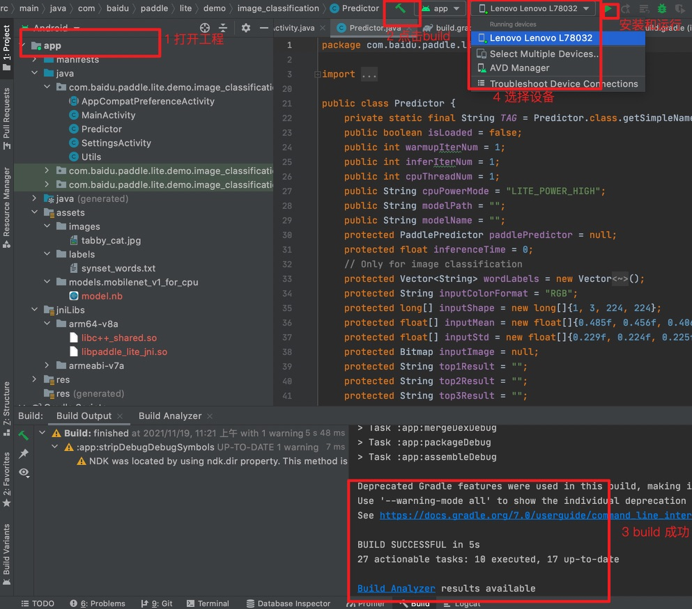
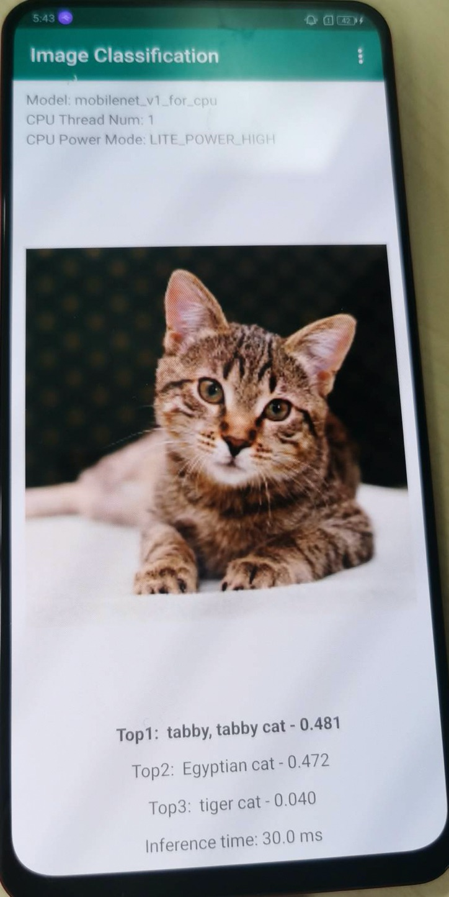
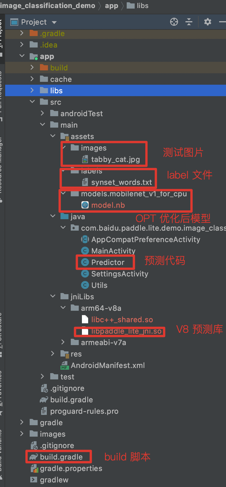
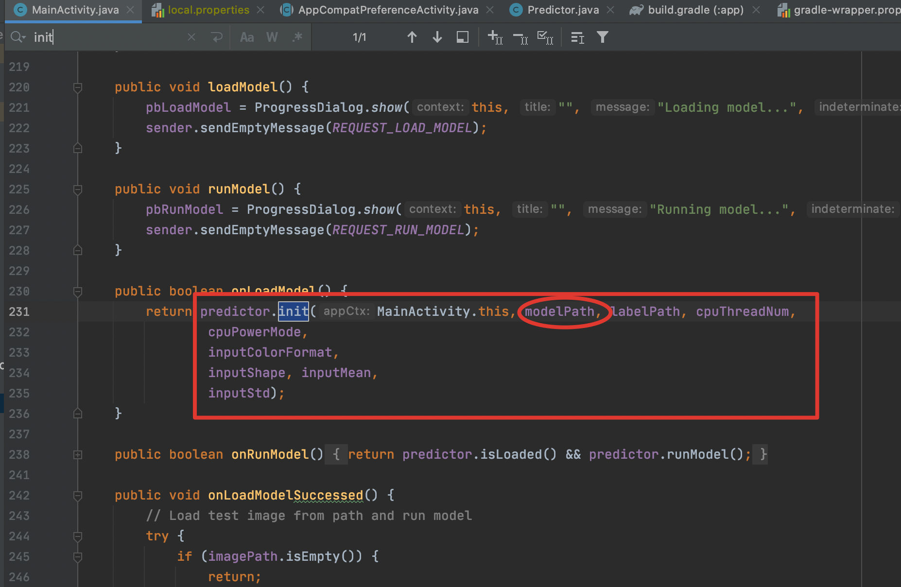
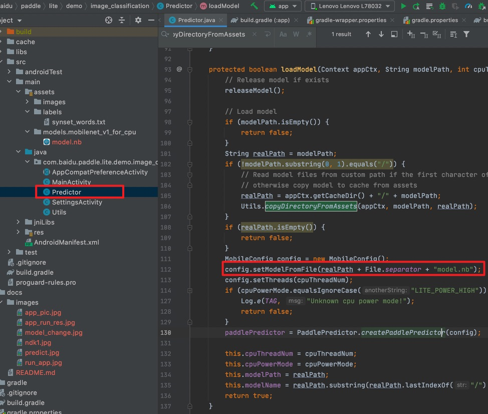
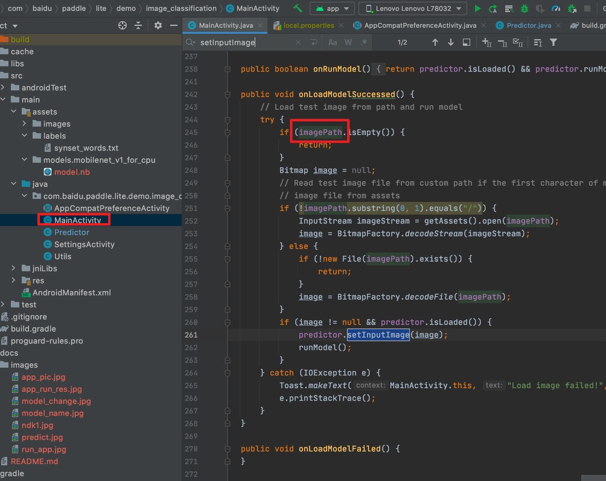
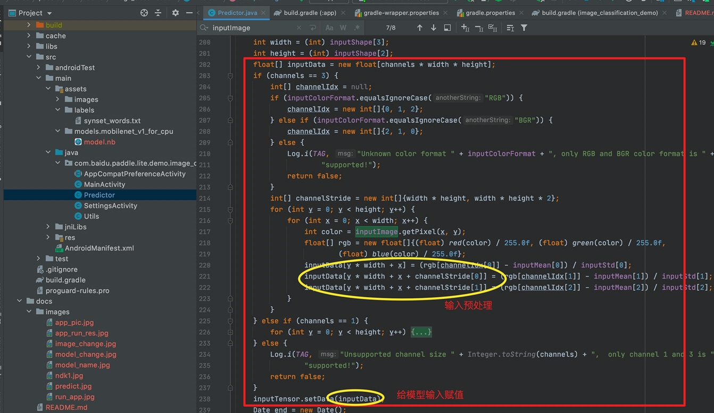
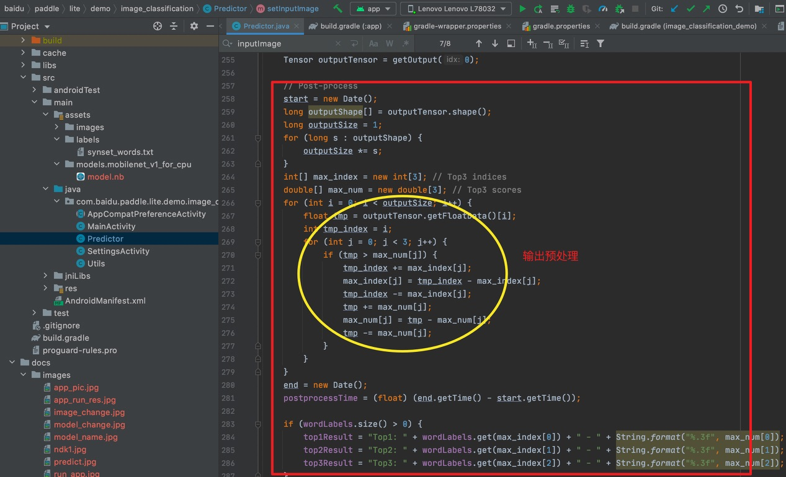

# 图像分类 Java API Demo 使用指南
本文主要介绍图像分类 Demo 运行方法和如何在更新模型/输入/输出处理下，保证图像分类 demo 仍可继续运行。
## 如何运行图像分类 Demo
### 环境准备

1. 在本地环境安装好 Android Studio 工具，详细安装方法请见[Android Stuido 官网](https://developer.android.com/studio)。
2. 准备一部 Android 手机，并开启 USB 调试模式。开启方法: `手机设置 -> 查找开发者选项 -> 打开开发者选项和 USB 调试模式`

**注意**：如果您的 Android Studio 尚未配置 NDK ，请根据 Android Studio 用户指南中的[安装及配置 NDK 和 CMake ](https://developer.android.com/studio/projects/install-ndk)内容，预先配置好 NDK 。您可以选择最新的 NDK 版本，或者使用
Paddle Lite 预测库版本一样的 NDK

### 部署步骤

1. 图像分类 Demo 位于 `Paddle-Lite-Demo/PaddleLite-android-demo/image_classifiction_demo` 目录
2. 用 Android Studio 打开 image_classifiction_demo 工程
3. 手机连接电脑，打开 USB 调试和文件传输模式，并在 Android Studio 上连接自己的手机设备（手机需要开启允许从 USB 安装软件权限）
<p align="center">



</p>

> **注意：**
>> 如果您在导入项目、编译或者运行过程中遇到 NDK 配置错误的提示，请打开 ` File > Project Structure > SDK Location`，修改 `Andriod NDK location` 为您本机配置的 NDK 所在路径。
>> 如果您是通过 Andriod Studio 的 SDK Tools 下载的 NDK (见本章节"环境准备")，可以直接点击下拉框选择默认路径。
>> 还有一种 NDK 配置方法，你可以在 `image_classifiction_demo/local.properties` 文件中手动完成 NDK 路径配置，如下图所示
>> 如果以上步骤仍旧无法解决 NDK 配置错误，请尝试根据 Andriod Studio 官方文档中的[更新 Android Gradle 插件](https://developer.android.com/studio/releases/gradle-plugin?hl=zh-cn#updating-plugin)章节，尝试更新Android Gradle plugin版本。

4. 点击 Run 按钮，自动编译 APP 并安装到手机。(该过程会自动下载 Paddle Lite 预测库和模型，需要联网)
成功后效果如下，图一：APP 安装到手机        图二： APP 打开后的效果，会自动识别图片中的物体并标记

<p align="center">&#8194;&#8194;&#8194;&#8194;&#8194;</p>

## 图像分类 Demo 结构解析

Android 示例的代码结构如下图所示：
<p align="center"></p>

 1. `Predictor.java`： 预测代码

```shell
# 位置：
image_classifiction_demo/app/src/main/java/com/baidu/paddle/lite/demo/image_classifiction/Predictor.java
```

  2. `model.nb` : 模型文件 (opt 工具转化后 Paddle Lite 模型), `synset_words.txt`：训练模型时的 `labels` 文件

```shell
# 位置：
image_classifiction_demo/app/src/main/assets/models/mobilenet_v1_for_cpu/model.nb
image_classifiction_demo/app/src/main/assets/labels/synset_words.txt
```

  3. `libpaddle_lite_jni.so、PaddlePredictor.jar`：Paddle Lite Java 预测库与 Jar 包

```shell
# 位置
image_classifiction_demo/app/src/main/jniLibs/arm64-v8a/libpaddle_lite_jni.so
image_classifiction_demo/app/libs/PaddlePredictor.jar
# 如果要替换动态库 so 和 jar 文件，则将新的动态库 so 更新到 `image_classifiction_demo/app/src/main/jniLibs/arm64-v8a/` 目录下，新的 jar 文件更新至 `image_classifiction_demo/app/libs/` 目录下
```

  4. `build.gradle` : 定义编译过程的 gradle 脚本。（不用改动，定义了自动下载 Paddle Lite 预测和模型的过程）

```shell
# 位置
image_classifiction_demo/app/build.gradle
# 如果需要手动更新模型和预测库，则可将 gradle 脚本中的 `download*` 接口注释即可
```

## 代码讲解 （使用 Paddle Lite `Java API` 执行预测）

Android 示例基于 Java API 开发，调用 Paddle Lite `Java API` 包括以下五步。更详细的 `API` 描述参考：[Paddle Lite Java API ](https://paddle-lite.readthedocs.io/zh/latest/api_reference/java_api_doc.html)。

```c++
// 导入 Java API
import com.baidu.paddle.lite.MobileConfig;
import com.baidu.paddle.lite.Tensor;
import com.baidu.paddle.lite.Predictor;
import com.baidu.paddle.lite.PowerMode;

// 1. 写入配置：设置 MobileConfig
MobileConfig config = new MobileConfig();
config.setModelFromFile(<modelPath>); // 设置 Paddle Lite 模型路径
config.setPowerMode(PowerMode.LITE_POWER_NO_BIND); // 设置 CPU 运行模式
config.setThreads(4); // 设置工作线程数

// 2. 创建 PaddlePredictor
PaddlePredictor predictor = PaddlePredictor.createPaddlePredictor(config);

// 3. 设置输入数据
long[] dims = {1, 3, 224, 224};
float[] inputBuffer = new float[1*3*224*224];
for (int i = 0; i < 1*3*224*224; ++i) {
    inputBuffer[i] = i;
}
// 如果输入是图片，则可在第三步时将预处理后的图像数据赋值给输入 Tensor
Tensor input = predictor.getInput(0);
input.resize(dims);
input.setData(inputBuffer);

// 4. 执行预测
predictor.run();

// 5. 获取输出数据
Tensor result = predictor.getOutput(0);
float[] output = result.getFloatData();
for (int i = 0; i < 1001; ++i) {
    System.out.println(output[i]);
}

// 例如图像分类：输出后处理，输出分类结果
// Fetch output tensor
Tensor outputTensor = getOutput(0);

// Post-process
long outputShape[] = outputTensor.shape();
long outputSize = 1;
 for (long s : outputShape) {
   outputSize *= s;
}
int[] max_index = new int[3]; // Top3 indices
double[] max_num = new double[3]; // Top3 scores
for (int i = 0; i < outputSize; i++) {
  float tmp = outputTensor.getFloatData()[i];
  int tmp_index = i;
  for (int j = 0; j < 3; j++) {
     if (tmp > max_num[j]) {
         tmp_index += max_index[j];
         max_index[j] = tmp_index - max_index[j];
         tmp_index -= max_index[j];
         tmp += max_num[j];
          max_num[j] = tmp - max_num[j];
          tmp -= max_num[j];
     }
  }
}

```

## 如何更新模型和输入/输出预处理

### 更新模型
1. 将优化后的模型存放到目录 `image_classifiction_demo/app/src/main/assets/models/` 下；
2. 如果模型名字跟工程中模型名字一模一样，即均是使用 `mobilenet_v1_for_cpu/model.nb`，则代码不需更新；否则话，需要修改 `image_classifiction_demo/app/src/main/java/com.baidu.paddle.lite.demo.image_classifiction/MainActivity.java` 中代码：
<p align="centet">

</p>

以更新 mobilenet_v2 模型为例，则先将优化后的模型存放到 `image_classifiction_demo/app/src/main/assets/models/mobilenet_v2_for_cpu/mv2.nb` 下，然后更新代码

```c++
// 代码文件 `image_classifiction_demo/app/src/main/java/com.baidu.paddle.lite.demo.image_classifiction/MainActivity.java`
public boolean onLoadModel() {
  modelPath = "models/mobilenet_v2_for_cpu/"; // change modelPath
  return predictor.init(MainActivity.this, modelPath, labelPath, cpuThreadNum,
                cpuPowerMode, inputColorFormat, inputShape, inputMean,
                inputStd);
}
```
**注意：**

- 如果优化后的模型名字不是 `model.nb`，则需要将优化后的模型名字更新为 `model.nb` 或修改 `image_classifiction_demo/app/src/main/java/com.baidu.paddle.lite.demo.image_classifiction/Predictor.java` 中代码
<p align="centet">

</p>

```c++
// 代码文件 `image_classifiction_demo/app/src/main/java/com.baidu.paddle.lite.demo.image_classifiction/Predictor.java`
config.setModelFromFile(realPath + File.separator + "model.nb");
更新：config.setModelFromFile(realPath + File.separator + "mv2.nb");

```

- 如果需要更新 `synset_words.txt` 标签文件，则需要将新的标签文件存放在目录 `image_classifiction_demo/app/src/main/assets/labels/` 下，并更新 `image_classifiction_demo/app/src/main/java/com.baidu.paddle.lite.demo.image_classifiction/MainActivity.java` 中 init 方法的标签文件路径名。

```c++
// 代码文件 `image_classifiction_demo/app/src/main/java/com.baidu.paddle.lite.demo.image_classifiction/MainActivity.java`
public boolean onLoadModel() {
  labelPath = "labels/new_label.txt"; // change labelPath
  return predictor.init(MainActivity.this, modelPath, labelPath, cpuThreadNum,
                cpuPowerMode, inputColorFormat, inputShape, inputMean,
                inputStd);
}
```

### 更新输入/输出预处理
1. 更新输入数据

- 将更新的图片存放在 `image_classifiction_demo/app/src/main/assets/images/` 下；
- 更新文件 `image_classifiction_demo/app/src/main/java/com.baidu.paddle.lite.demo.image_classifiction/MainActivity.java`  中的代码

以更新 `dog.jpg` 为例，则先将 `dog.jpg` 存放在 `image_classifiction_demo/app/src/main/assets/images/` 下，然后更新代码

<p align="centet">

</p>

```c++
// 代码文件 `image_classifiction_demo/app/src/main/java/com.baidu.paddle.lite.demo.image_classifiction/MainActivity.java` 中 init 方法的图片路径
public void onLoadModelSuccessed() {
        // Load test image from path and run model
        imagePath = "images/dog.jpg"; // change image_path
        try {
            if (imagePath.isEmpty()) {
                return;
            }
            Bitmap image = null;
            // Read test image file from custom path if the first character of mode path is '/', otherwise read test
            // image file from assets
            if (!imagePath.substring(0, 1).equals("/")) {
                InputStream imageStream = getAssets().open(imagePath);
                image = BitmapFactory.decodeStream(imageStream);
            } else {
                if (!new File(imagePath).exists()) {
                    return;
                }
                image = BitmapFactory.decodeFile(imagePath);
            }
            if (image != null && predictor.isLoaded()) {
                predictor.setInputImage(image);
                runModel();
            }
        } catch (IOException e) {
            Toast.makeText(MainActivity.this, "Load image failed!", Toast.LENGTH_SHORT).show();
            e.printStackTrace();
        }
}
```

2. 更新输入预处理
此处需要更新 `image_classifiction_demo/app/src/main/java/com.baidu.paddle.lite.demo.image_classifiction/Predictor.java` 中的输入预处理代码实现。
<p align="centet">

</p>
**注意：**
根据需求，可将输入预处理代码封装成一个方法，通过调用不同预处理方法进行赋值

3. 更新输出预处理
此处需要更新 `image_classifiction_demo/app/src/main/java/com.baidu.paddle.lite.demo.image_classifiction/Predictor.java` 中的输出预处理代码实现。
<p align="centet">

</p>
**注意：**
根据需求，可将输出预处理代码封装成一个方法，通过调用不同预处理方法进行处理

