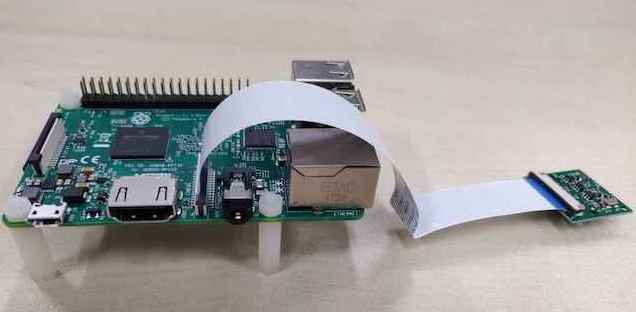
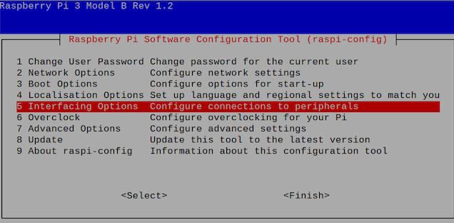
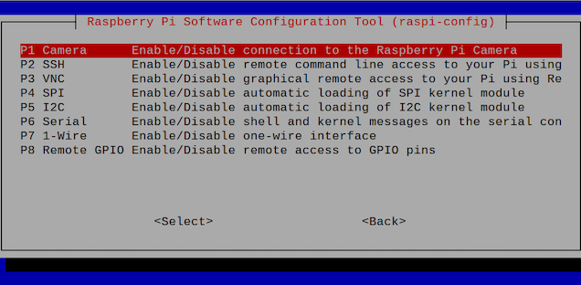
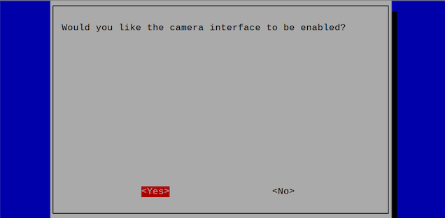
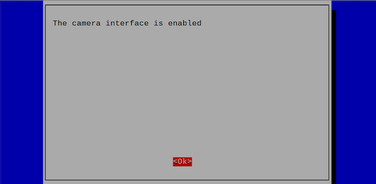

# ARMLinux（树莓派3B）摄像头的购买、安装、使能与验证

## 1、树莓派Raspberry Pi camera的购买

树莓派Raspberry Pi camera可以从淘宝、京东等平台购买。

## 2、安装Raspberry Pi camera

将树莓派 3B 断电后，将摄像头如下图安装在树莓派上。



## 3、树莓派 3B 使能摄像头

执行命令

```shell
sudo raspi-config
```
进入设置页面后，之后按照下面步骤设置

1. 选择 `Interfacing Options`



2. 选择 `Camera`



3. 点击 `Yes`



4. 点击 `Ok`



5. 之后重启树莓派

## 4、测试摄像头是否使能成功

执行命令

```shell
sudo raspistill -o test.jpg 
```

之后使用树莓派自带的`xdg-open`打开图片

```shell
sudo xdg-open test.jpg
```

## 5、opencv可以使用树莓派的摄像头

在命令行中输入

```shell
sudo nano /etc/modules  
```

在 `/etc/modules` 中添加 `bcm2835-v4l2`，如下图所示。 之后先按下`Control` + `o`，之后按下`Enter`保存；接着执行`Control` + `x`退出编辑。
