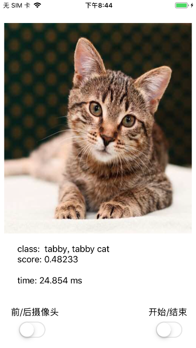
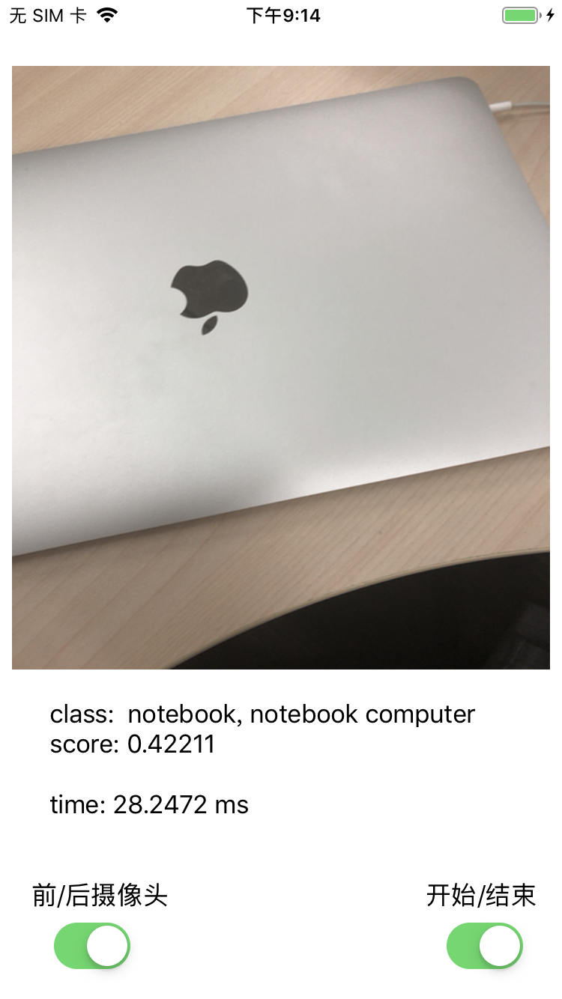
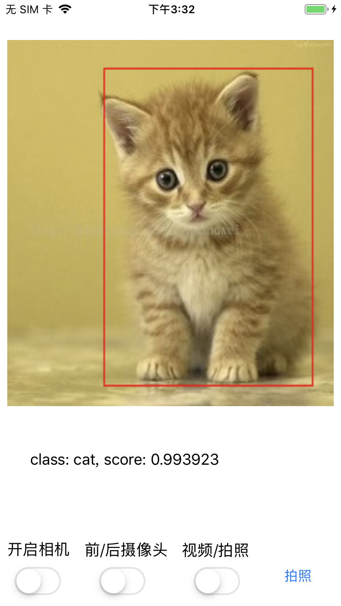
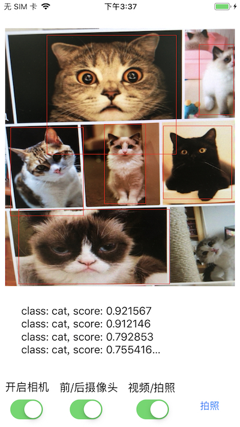
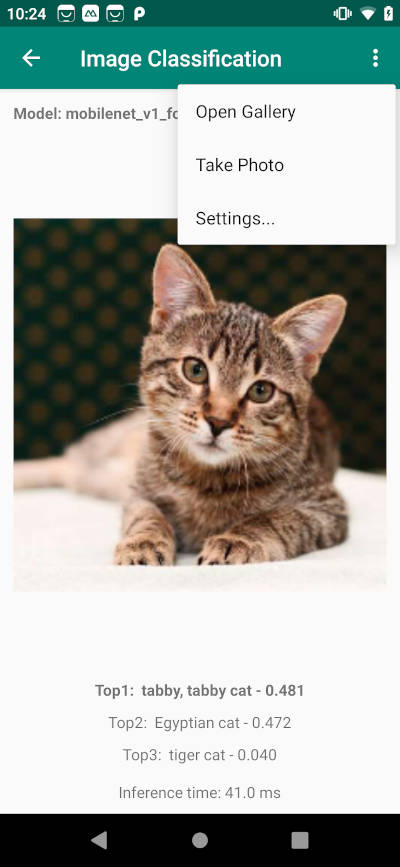
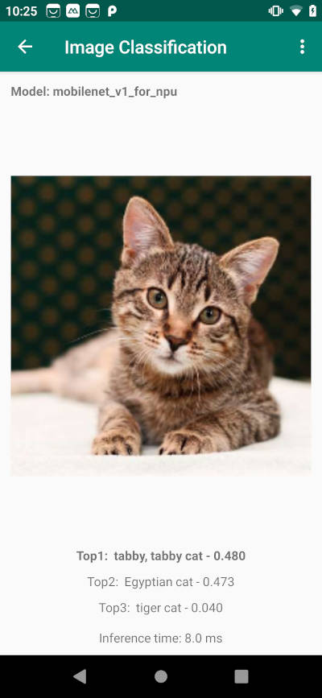
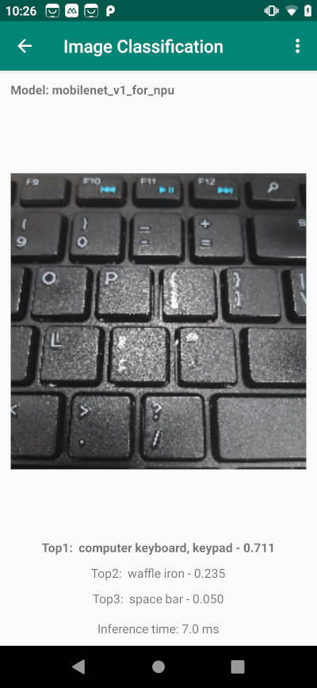
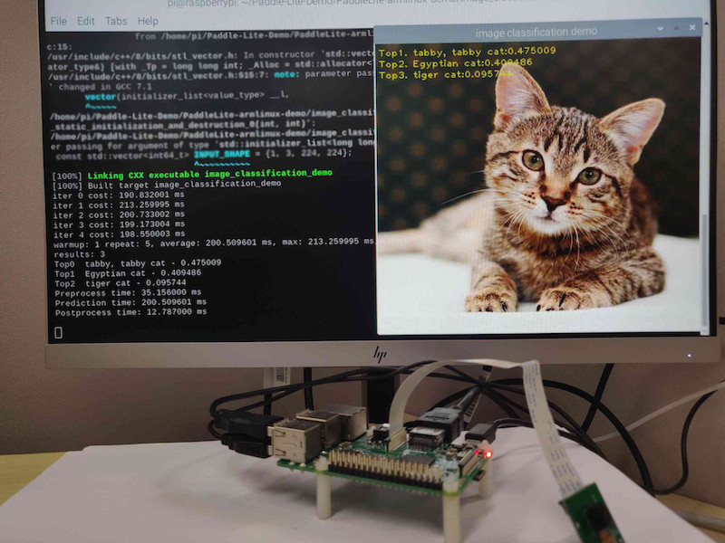
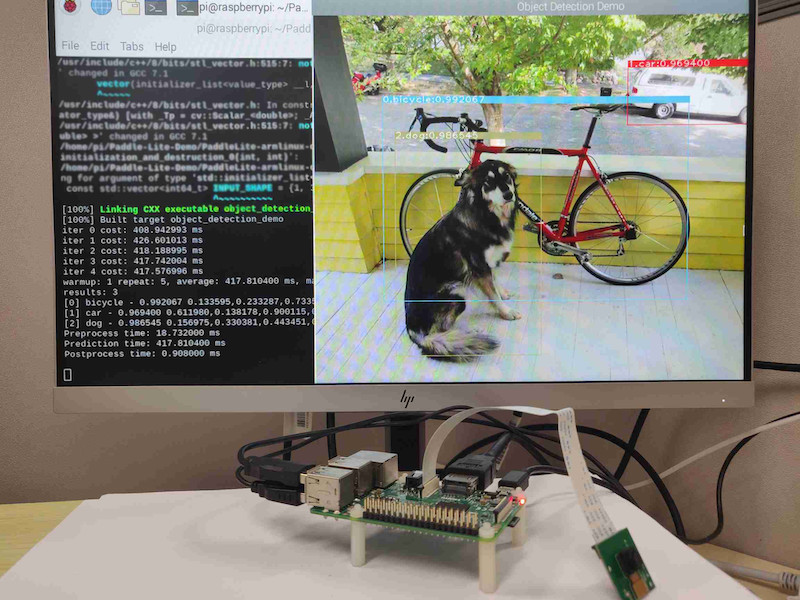

# Paddle-Lite-Demo


## 功能
* iOS示例:
    * 静态图像目标分类和视频流目标分类；
    * 静态图像目标检测、相机拍照目标检测、相机视频流目标检测;
* Android示例:
    * 基于MobileNetV1的图像分类；
    * 基于MobileNetV1-SSD的目标检测；
* ARMLinux示例:
    * 基于MobileNetV1的图像分类；
    * 基于MobileNetV1-SSD的目标检测；

## 要求

* iOS
    * Mac机器，需要有xcode环境（已验证：Xcode Version 10.1 (10B61)
    * 对于ios 12.x版本，如果提示“xxx.  which may not be supported by this version of Xcode”，请下载对应的[工具包]( https://github.com/iGhibli/iOS-DeviceSupport), 下载完成后解压放到/Applications/Xcode.app/Contents/Developer/Platforms/iPhoneOS.platform/DeviceSupport目录，重启xcode

* Android
    * Android Studio 3.4
    * Android手机或开发版，NPU功能暂时只在麒麟810和990芯片的华为手机（如Nova5系列）进行了测试，使用前请将EMUI更新到最新版本；

* ARMLinux
    * RK3399（[Ubuntu 18.04](http://www.t-firefly.com/doc/download/page/id/3.html)） 或 树莓派3B（[Raspbian Buster with desktop](https://www.raspberrypi.org/downloads/raspbian/)），暂时验证了这两个软、硬件环境，其它平台用户可自行尝试；
    * 支持树莓派3B摄像头采集图像，具体参考[树莓派3B摄像头安装与测试](/PaddleLite-armlinux-demo/enable-camera-on-raspberry-pi.md)
    * gcc g++ opencv cmake的安装（以下所有命令均在设备上操作）
    ```bash
    $ sudo apt-get update
    $ sudo apt-get install gcc g++ make wget unzip libopencv-dev pkg-config
    $ wget https://www.cmake.org/files/v3.10/cmake-3.10.3.tar.gz
    $ tar -zxvf cmake-3.10.3.tar.gz
    $ cd cmake-3.10.3
    $ ./configure
    $ make
    $ sudo make install
    ```

## 安装
$ git clone https://github.com/PaddlePaddle/Paddle-Lite-Demo

* iOS
    * 在PaddleLite-ios-demo目录下执行
    ```bash
    $ chmod +x download_dependencies.sh
    $ ./download_dependencies.sh
    ```
    该脚本会离线下载并解压ios demo所需要的依赖，包括paddle-lite 预测库，demo所需要的模型，opencv framework
    * 打开xcode，点击“Open another project…”打开`Paddle-Lite-Demo/PaddleLite-ios-demo/ios-xxx_demo/`目录下的xcode工程；
    * 在选中左上角“project navigator”，选择“classification_demo”，修改“General”信息；
    * 插入ios真机（已验证：iphone8， iphonexr），选择Device为插入的真机；
    * 点击左上角“build and run”按钮；

* Android
    * 打开Android Studio，在"Welcome to Android Studio"窗口点击"Open an existing Android Studio project"，在弹出的路径选择窗口中进入"image_classification_demo"目录，然后点击右下角的"Open"按钮即可导入工程
    * 通过USB连接Android手机或开发板；
    * 载入工程后，点击菜单栏的Run->Run 'App'按钮，在弹出的"Select Deployment Target"窗口选择已经连接的Android设备，然后点击"OK"按钮；
    * 由于Demo所用到的库和模型均通过app/build.gradle脚本在线下载，因此，第一次编译耗时较长（取决于网络下载速度），请耐心等待；
    * 如果库和模型下载失败，建议手动下载并拷贝到相应目录下：1) [paddle_lite_libs.tar.gz](https://paddlelite-demo.bj.bcebos.com/libs/android/paddle_lite_libs_v2_1_0.tar.gz)：解压后将java/PaddlePredictor.jar拷贝至Paddle-Lite-Demo/PaddleLite-android-demo/image_classification_demo/app/libs，将java/libs/armeabi-v7a/libpaddle_lite_jni.so拷贝至Paddle-Lite-Demo/PaddleLite-android-demo/image_classification_demo/app/src/main/jniLibs/armeabi-v7a/libpaddle_lite_jni.so，将java/libs/armeabi-v8a/libpaddle_lite_jni.so拷贝至Paddle-Lite-Demo/PaddleLite-android-demo/image_classification_demo/app/src/main/jniLibs/arm64-v8a/libpaddle_lite_jni.so 2）[mobilenet_v1_for_cpu.tar.gz](https://paddlelite-demo.bj.bcebos.com/models/mobilenet_v1_fp32_224_for_cpu_v2_1_0.tar.gz)：解压至Paddle-Lite-Demo/PaddleLite-android-demo/image_classification_demo/app/src/main/assets/models/mobilenet_v1_for_cpu 3）[mobilenet_v1_for_npu.tar.gz](https://paddlelite-demo.bj.bcebos.com/models/mobilenet_v1_fp32_224_for_npu_v2_1_0.tar.gz)：解压至Paddle-Lite-Demo/PaddleLite-android-demo/image_classification_demo/app/src/main/assets/models/mobilenet_v1_for_npu 4）[ssd_mobilenet_v1_pascalvoc_for_cpu.tar.gz](https://paddlelite-demo.bj.bcebos.com/models/ssd_mobilenet_v1_pascalvoc_fp32_300_for_cpu_v2_1_0.tar.gz)：解压至Paddle-Lite-Demo/PaddleLite-android-demo/object_detection_demo/app/src/main/assets/models/ssd_mobilenet_v1_pascalvoc_for_cpu ；
    * 在图像分类Demo中，默认会载入一张猫的图像，并会在图像下方给出CPU的预测结果，如果你使用的是麒麟810或990芯片的华为手机（如Nova5系列），可以在右上角的上下文菜单选择"Settings..."打开设置窗口切换NPU模型进行预测；
    * 在图像分类Demo中，你还可以通过上方的"Gallery"和"Take Photo"按钮从相册或相机中加载测试图像；

* ARMLinux
    * 模型和预测库下载
    ```bash
    $ cd Paddle-Lite-Demo/PaddleLite-armlinux-demo
    $ ./download_models_and_libs.sh # 下载模型和预测库
    ```   
    * 图像分类Demo的编译与运行（以下所有命令均在设备上操作）
    ```bash
    $ cd Paddle-Lite-Demo/PaddleLite-armlinux-demo/image_classification_demo
    $ ./run.sh armv8 # RK3399
    $ ./run.sh armv7hf # 树莓派3B
    ```
    在终端打印预测结果和性能数据，同时在build目录中生成result.jpg。
    * 目标检测Demo的编译与运行（以下所有命令均在设备上操作）
    ```bash
    $ cd Paddle-Lite-Demo/PaddleLite-armlinux-demo/object_detection_demo
    $ ./run.sh armv8 # RK3399
    $ ./run.sh armv7hf # 树莓派3B
    ```
    在终端打印预测结果和性能数据，同时在build目录中生成result.jpg。

## 更新到最新的预测库
* Paddle-Lite项目：https://github.com/PaddlePaddle/Paddle-Lite
* 参考 [Paddle-Lite文档](https://github.com/PaddlePaddle/Paddle-Lite/wiki)，编译IOS预测库或者Android预测库
* 编译最终产物位于 `build.lite.xxx.xxx.xxx` 下的 `inference_lite_lib.xxx.xxx`
### IOS更新预测库
* 替换库文件：产出的`lib`目录替换`Paddle-Lite-Demo/PaddleLite-ios-demo/ios-classification_demo/classification_demo/lib`目录
* 替换头文件：产出的`include`目录下的文件替换`Paddle-Lite-Demo/PaddleLite-ios-demo/ios-classification_demo/classification_demo/paddle_lite`目录下的文件

### Android更新预测库
* 仅支持CPU
  * 替换jar文件：将PaddleLite编译生成的build.lite.android.xxx.gcc/inference_lite_lib.android.xxx/java/jar/PaddlePredictor.jar替换demo中的Paddle-Lite-Demo/PaddleLite-android-demo/image_classification_demo/app/libs/PaddlePredictor.jar
  * 替换arm64-v8a jni库文件：将Paddle-Lite编译生成build.lite.android.armv8.gcc/inference_lite_lib.android.armv8/java/so/libpaddle_lite_jni.so库替换demo中的Paddle-Lite-Demo/PaddleLite-android-demo/image_classification_demo/app/src/main/jniLibs/arm64-v8a/libpaddle_lite_jni.so
  * 替换armeabi-v7a jni库文件：将Paddle-Lite编译生成的build.lite.android.armv7.gcc/inference_lite_lib.android.armv7/java/so/libpaddle_lite_jni.so库替换demo中的Paddle-Lite-Demo/PaddleLite-android-demo/image_classification_demo/app/src/main/jniLibs/armeabi-v7a/libpaddle_lite_jni.so.

* 支持CPU和NPU
  * 替换jar文件：将PaddleLite编译生成的build.lite.npu.android.xxx.gcc.cxx_shared.tiny_publish/inference_lite_lib.android.xxx.npu/java/jar/PaddlePredictor.jar替换demo中的Paddle-Lite-Demo/PaddleLite-android-demo/image_classification_demo/app/libs/PaddlePredictor.jar
  * 替换arm64-v8a jni库文件：将Paddle-Lite编译生成build.lite.npu.android.armv8.gcc.cxx_shared.tiny_publish/inference_lite_lib.android.armv8.npu/java/so/libpaddle_lite_jni.so库替换demo中的Paddle-Lite-Demo/PaddleLite-android-demo/image_classification_demo/app/src/main/jniLibs/arm64-v8a/libpaddle_lite_jni.so
  * 替换armeabi-v7a jni库文件：将Paddle-Lite编译生成的build.lite.npu.android.armv7.gcc.cxx_shared.tiny_publish/inference_lite_lib.android.armv7.npu/java/so/libpaddle_lite_jni.so库替换demo中的Paddle-Lite-Demo/PaddleLite-android-demo/image_classification_demo/app/src/main/jniLibs/armeabi-v7a/libpaddle_lite_jni.so.

  编译支持NPU的jni库，需要在Paddle-Lite源码下使用$ ./lite/tools/build_npu.sh --arm_abi=armv8 tiny_publish命令编译生成armv64-v8a的libpaddle_lite_jni.so，armeabi-v7a的libpaddle_lite_jni.so请将编译命令中的--arm_abi=armv8改为--arm_abi=armv7，但由于华为最新的DDK库并没有发布，可能无法完成相关编译工作，因此，如果想使用NPU功能，强烈建议使用demo中自带的libpaddle_lite_jni.so和HIAI DDK库；

### ARMLinux
* 替换头文件目录，将生成的cxx中的`include`目录替换`Paddle-Lite-Demo/PaddleLite-armlinux-demo/Paddle-Lite/include`目录；
* 替换armv8动态库，将生成的cxx/libs中的`libpaddle_light_api_shared.so`替换`Paddle-Lite-Demo/PaddleLite-armlinux-demo/Paddle-Lite/libs/armv8/libpaddle_light_api_shared.so`；
* 替换armv7hf动态库，将生成的cxx/libs中的`libpaddle_light_api_shared.so`替换`Paddle-Lite-Demo/PaddleLite-armlinux-demo/Paddle-Lite/libs/armv7hf/libpaddle_light_api_shared.so`；

## 效果展示

* iOS
    * mobilenetv1 目标分类

          

    * mobilenetv1-ssd 目标检测

          

* Android
    * mobilenetv1 目标分类

      - CPU预测结果（测试环境：华为nova5）

            

      - NPU预测结果（测试环境：华为nova5）

            

    * mobilenetv1-ssd 目标检测

      - CPU预测结果（测试环境：华为nova5）

      

      - NPU预测结果（测试环境：华为nova5）

      待支持

* ARMLinux
     * mobilenetv1 目标分类

     

     * mobilenetv1-ssd 目标检测

     
