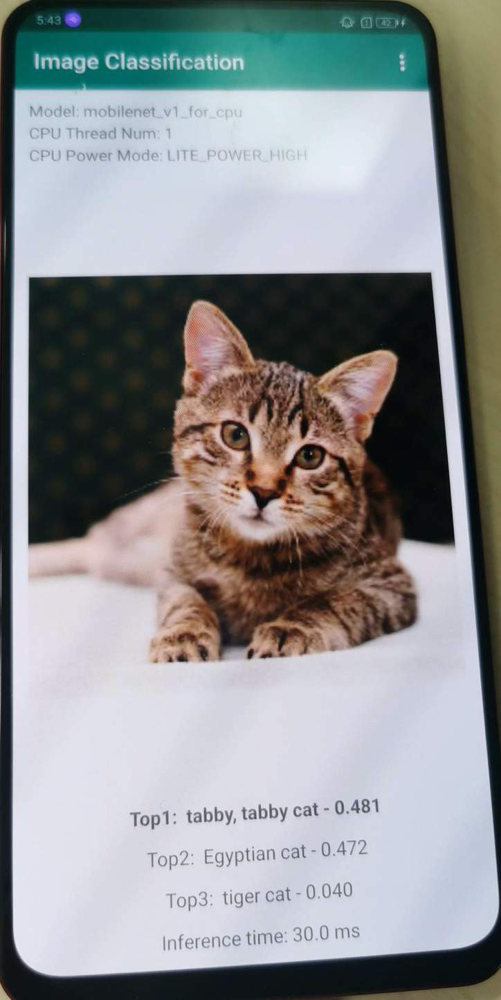
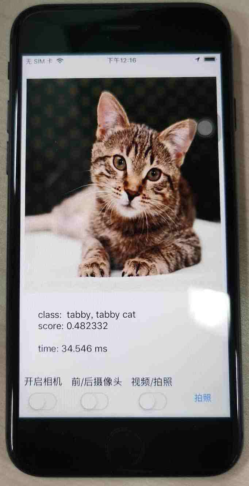
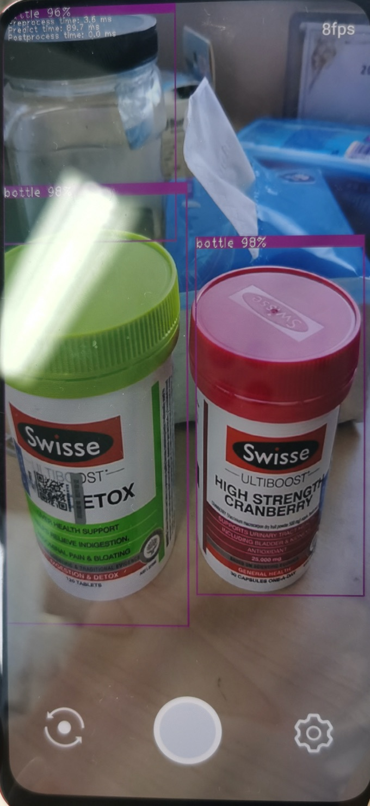
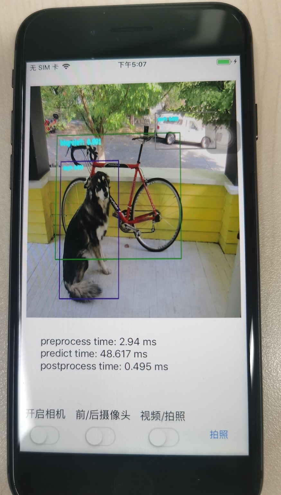
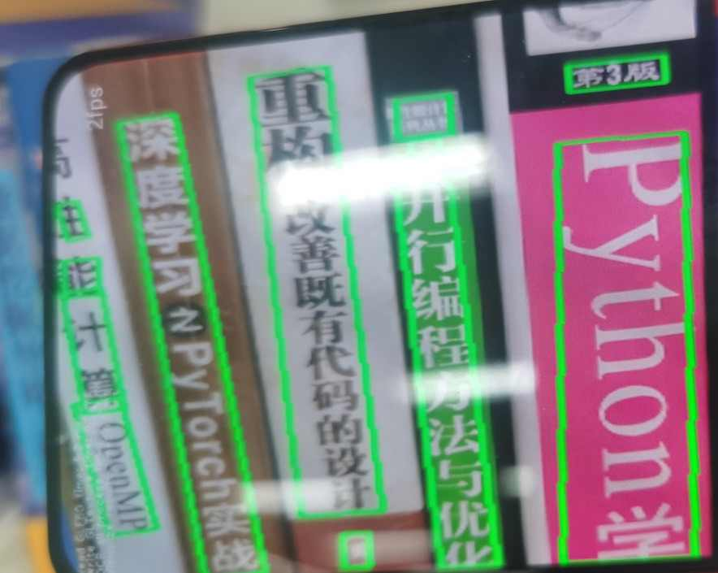

# Paddle-Lite-Demo

Paddle-Lite 提供了多个应用场景的 demo，并支持 Android、iOS 和 ArmLinux 三个平台：
* 图像分类
    * 基于 [mobilenet_v1](https://paddlelite-demo.bj.bcebos.com/models/mobilenet_v1_fp32_224.tar.gz) 模型
      * [Android 示例](./image_classification/android/)
      * [iOS 示例](./image_classification/ios/)
      * [ArmLinux 示例](./image_classification/armlinux/)
* 目标检测
    * 基于 [ssd_mobilenetv1](https://paddlelite-demo.bj.bcebos.com/demo/object_detection/models/ssd_mobilenet_v1_pascalvoc_fp32_300_fluid.tar.gz) 模型
      * [Android 示例](./object_detection/android/app/cxx/ssd_mobilenetv1_detection_demo/)
      * [iOS 示例](./object_detection/ios/ssd_mobilenetv1_demo/)
    * 基于 [pp_picodet](https://paddlelite-demo.bj.bcebos.com/demo/object_detection/models/picodet_s_320_coco_for_cpu.tar.gz) 模型
      * [Android 示例](./object_detection/android/app/cxx/picodet_detection_demo/)
      * [iOS 示例](./object_detection/ios/picodet_demo/)
* 文字识别
    * 基于 [pp_ocr_det](https://paddleocr.bj.bcebos.com/dygraph_v2.0/slim/ch_ppocr_mobile_v2.0_det_slim_infer.tar)、[pp_ocr_rec](https://paddleocr.bj.bcebos.com/dygraph_v2.0/slim/ch_ppocr_mobile_v2.0_rec_slim_infer.tar) 和 [pp_ocr_cls](https://paddleocr.bj.bcebos.com/dygraph_v2.0/slim/ch_ppocr_mobile_v2.0_cls_slim_infer.tar) 模型
      * [Android 示例](./ocr/android/)
      * [iOS 示例](./ocr/ios/)
* 人脸检测
   * 基于 [face-detection](https://paddlelite-demo.bj.bcebos.com/models/facedetection_fp32_240_430_fluid.tar.gz) 模型
      * [Android 示例](./face_detection/android/)
      * iOS 示例
* 人脸关键点检测
   * 基于 [face-detection](https://paddlelite-demo.bj.bcebos.com/models/facedetection_fp32_240_430_fluid.tar.gz) 和 [face-keypoint](https://paddlelite-demo.bj.bcebos.com/models/facekeypoints_detector_fp32_60_60_fluid.tar.gz) 模型
      * [Android 示例](./face_keypoints_detection/android/)
      * iOS 示例
* 口罩识别
   * 基于 [pyramidbox](https://paddlelite-demo.bj.bcebos.com/models/pyramidbox_lite_fp32_fluid.tar.gz) + [mask_detect](https://paddlelite-demo.bj.bcebos.com/models/mask_detector_fp32_128_128_fluid.tar.gz) 模型
      * [Android 示例](./mask_detection/android/)
      * iOS 示例
* 人像分割
   * 基于 [DeeplabV3](https://paddlelite-demo.bj.bcebos.com/models/deeplab_mobilenet_fp32_fluid.tar.gz) 模型
      * [Android 示例](./human_segmentation/android/)
      * iOS 示例


关于 Paddle-Lite 更多示例，请参考如下文档链接：
- [文档官网](https://paddle-lite.readthedocs.io/zh/latest/index.html)
- [Android 示例](https://paddle-lite.readthedocs.io/zh/latest/demo_guides/android_app_demo.html) [[图像分类]](https://paddlelite-demo.bj.bcebos.com/apps/android/mobilenet_classification_demo.apk)  [[目标检测]](https://paddlelite-demo.bj.bcebos.com/apps/android/yolo_detection_demo.apk) [[口罩检测]](https://paddlelite-demo.bj.bcebos.com/apps/android/mask_detection_demo.apk)  [[人脸关键点]](https://paddlelite-demo.bj.bcebos.com/apps/android/face_keypoints_detection_demo.apk) [[人像分割]](https://paddlelite-demo.bj.bcebos.com/apps/android/human_segmentation_demo.apk)
- [iOS 示例](https://paddle-lite.readthedocs.io/zh/latest/demo_guides/ios_app_demo.html)
- [ARMLinux 示例](https://paddle-lite.readthedocs.io/zh/latest/demo_guides/linux_arm_demo.html)
- [X86 示例](https://paddle-lite.readthedocs.io/zh/latest/demo_guides/x86.html)
- [OpenCL 示例](https://paddle-lite.readthedocs.io/zh/latest/demo_guides/opencl.html)
- [FPGA 示例](https://paddle-lite.readthedocs.io/zh/latest/demo_guides/fpga.html)
- [华为 NPU 示例](https://paddle-lite.readthedocs.io/zh/latest/demo_guides/huawei_kirin_npu.html)
- [百度 XPU 示例](https://paddle-lite.readthedocs.io/zh/latest/demo_guides/baidu_xpu.html)
- [瑞芯微 NPU 示例](https://paddle-lite.readthedocs.io/zh/latest/demo_guides/rockchip_npu.html)
- [联发科 APU 示例](https://paddle-lite.readthedocs.io/zh/latest/demo_guides/mediatek_apu.html)

## 要求

* iOS
    * macOS+Xcode，已验证的环境：Xcode Version 11.5 (11E608c) on macOS Catalina(10.15.5)
    * Xcode 11.3会报"Invalid bitcode version ..."的编译错误，请将Xcode升级到11.4及以上的版本后重新编译
    * 对于ios 12.x版本，如果提示“xxx.  which may not be supported by this version of Xcode”，请下载对应的[工具包]( https://github.com/iGhibli/iOS-DeviceSupport), 下载完成后解压放到/Applications/Xcode.app/Contents/Developer/Platforms/iPhoneOS.platform/DeviceSupport目录，重启xcode

* Android
    * Android Studio 4.2；
    * adb调试工具；
    * Android手机或开发版；
    * 华为手机支持NPU的[ Demo](https://paddlelite-demo.bj.bcebos.com/devices/huawei/kirin/PaddleLite-android-demo_v2_9_0.tar.gz)（NPU的功能暂时只在nova5、mate30和mate30 5G上进行了测试，用户可自行尝试其它搭载了麒麟810和990芯片的华为手机（如nova5i pro、mate30 pro、荣耀v30，mate40或p40，且需要将系统更新到最新版）

* ARMLinux
    * RK3399（[Ubuntu 18.04](http://www.t-firefly.com/doc/download/page/id/3.html)） 或 树莓派3B（[Raspbian Buster with desktop](https://www.raspberrypi.org/downloads/raspbian/)），暂时验证了这两个软、硬件环境，其它平台用户可自行尝试；
    * 支持树莓派3B摄像头采集图像，具体参考[树莓派3B摄像头安装与测试](/PaddleLite-armlinux-demo/enable-camera-on-raspberry-pi.md)
    * gcc g++ opencv cmake的安装（以下所有命令均在设备上操作）
    ```bash
    $ sudo apt-get update
    $ sudo apt-get install gcc g++ make wget unzip libopencv-dev pkg-config
    $ wget https://www.cmake.org/files/v3.10/cmake-3.10.3.tar.gz
    $ tar -zxvf cmake-3.10.3.tar.gz
    $ cd cmake-3.10.3
    $ ./configure
    $ make
    $ sudo make install
    ```

## 安装
$ git clone https://github.com/PaddlePaddle/Paddle-Lite-Demo

* iOS
    * 在PaddleLite-ios-demo目录下执行download_dependencies.sh脚本，该脚本会离线下载并解压ios demo所需要的依赖，
      包括paddle-lite 预测库，demo所需要的模型，opencv framework
    ```bash
    $ chmod +x download_dependencies.sh
    $ ./download_dependencies.sh
    ```
    * 打开xcode，点击“Open another project…”打开`Paddle-Lite-Demo/PaddleLite-ios-demo/ios-xxx_demo/`目录下的xcode工程；
    * 在选中左上角“project navigator”，选择“classification_demo”，修改“General”信息；
    * 插入ios真机（已验证：iphone8， iphonexr），选择Device为插入的真机；
    * 点击左上角“build and run”按钮；

* Android
    * 打开Android Studio，在"Welcome to Android Studio"窗口点击"Open an existing Android Studio project"，在弹出的路径选择窗口中进入"image_classification_demo"目录，然后点击右下角的"Open"按钮即可导入工程
    * 通过USB连接Android手机或开发板；
    * 载入工程后，点击菜单栏的Run->Run 'App'按钮，在弹出的"Select Deployment Target"窗口选择已经连接的Android设备（连接失败请检查本机adb工具是否正常），然后点击"OK"按钮；
    * 由于Demo所用到的库和模型均通过app/build.gradle脚本在线下载，因此，第一次编译耗时较长（取决于网络下载速度），请耐心等待；
    * 对于图像分类Demo，如果库和模型下载失败，建议手动下载并拷贝到相应目录下：
      1) [paddle_lite_libs.tar.gz](https://paddlelite-demo.bj.bcebos.com/libs/android/paddle_lite_libs_v2_3_0.tar.gz)：解压后将 `inference_*/cxx` 拷贝至 `Paddle-Lite-Demo/image_classification/android/app/cxx/image_classification/app/PaddleLite/cxx`，将 `inference_*/java` 拷贝至 `Paddle-Lite-Demo/image_classification/android/app/cxx/image_classification/app/PaddleLite/java`
      2) [mobilenet_v1_for_cpu.tar.gz](https://paddlelite-demo.bj.bcebos.com/models/mobilenet_v1_fp32_224_for_cpu_v2_3_0.tar.gz)：解压至 `Paddle-Lite-Demo/image_classification/android/app/cxx/image_classification/app/app/src/main/assets/models/mobilenet_v1_for_cpu` 目录
    * 在图像分类Demo中，你还可以通过上方的"Gallery"和"Take Photo"按钮从相册或相机中加载测试图像；

* ARMLinux or Shell
    * 预测库下载
    ```bash
    $ cd Paddle-Lite-Demo/libs
    $ ./download.sh # 下载预测库
    ```
    * 图像分类Demo的编译与运行（以下所有命令均在设备上操作）
    ```bash
    $ cd Paddle-Lite-Demo/image_classification/assets
    $ ./download.sh # 下载模型、测试图片和标签文件
    $ cd Paddle-Lite-Demo/image_classification/android/shell/cxx/image_classification
    $ ./build.sh armv8 # 编译可执行文件，并运行程序
    ```
    在终端打印预测结果和性能数据。
    * 目标检测Demo的编译与运行（以下所有命令均在设备上操作）
    ```bash
    $ cd Paddle-Lite-Demo/object_detection/assets
    $ ./download.sh # 下载模型、测试图片和标签文件
    $ cd Paddle-Lite-Demo/object_detection/android/shell/cxx/yolov3_mobilenet_v3
    $ ./build.sh armv8 # 编译可执行文件，并运行程序
    ```
    在终端打印预测结果和性能数据，同时在build目录中生成dog_yolo_v3_mobilenetv3_detection_result.jpg.jpg。

## 效果展示

* 图像分类
  * 基于 MobileNetV1 的目标检测

  | Android | iOS | Armlinux |
  | ---     | --- | ---      |
  | |  | |
  
* 目标检测
  * 基于 MobileNetV1-SSD 的目标检测

  | Android | iOS |
  | ---     | --- |
  |     |  |
  
  * 基于 PP-Picodet 的目标检测

  | Android | iOS |
  | ---     | --- |
  |     |  |
  
* OCR

  | Android | iOS |
  | ---     | --- |
  |    |  | 

* 人脸检测

  | Android | iOS |
  | ---     | --- |
  |     | 补充中 | 
  
* 人脸关键点检测
  
  | Android | iOS |
  | ---     | --- |
  |     | 补充中 |

* 口罩识别
  
  | Android | iOS |
  | ---     | --- |
  |    | 补充中 |

* 人像分割
  
  | Android | iOS |
  | ---     | --- |
  |    | 补充中 |


## 性能优化

* 多线程设置：
  - demo 中线程数默认是1，用户可以根据手机大核个数，设置最大线程数。如小米9，它有4个A76 大核，线程数最大设置为4；
  - 设置方法：可以通过界面的setting 按钮进行更新，也可以通过修改源码（`config.set_threads()`）的线程数进行更新。
* FP16 推理：
  - demo 中模型默认是FP32 模型，如果**你是在armv8.2 架构以上的手机运行如小米9，则可选用FP16 模型进行推理**；否则，不能使用FP16 模型进行推理。
  - FP16 推理方法：如果 APP 中 `assets/model` 目录下提供了FP16 模型（nb 模型以_fp16结尾），用户只需更新源码模型路径就行；否则，用户需要下载 [OPT 可执行文件](https://github.com/PaddlePaddle/Paddle-Lite/releases/tag/v2.10)，并参考 [OPT 使用文档](https://paddle-lite.readthedocs.io/zh/develop/user_guides/opt/opt_bin.html)重新转换模型(将 `enable_fp16` 设置为 true，如 `--enable_fp16=1`），然后更新源码中模型路径即可。
  - 如果提供的预测库没有包含FP16 kernel 算子话，用户需要从 [release 仓库](https://github.com/PaddlePaddle/Paddle-Lite/tags)中下载含有FP16 kernel新的预测库。
* Int8/稀疏推理：
  - 用户可以使用 [PaddleSlim 工具](https://github.com/PaddlePaddle/PaddleSlim) 完成模型量化/稀疏化处理，进一步提升模型性能。
  - 使用方法：用 PaddleSlim 生成新模型，然后参考 FP16 推理方法，更新 demo 中预测模型即可。
