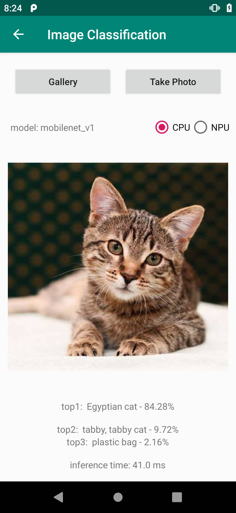
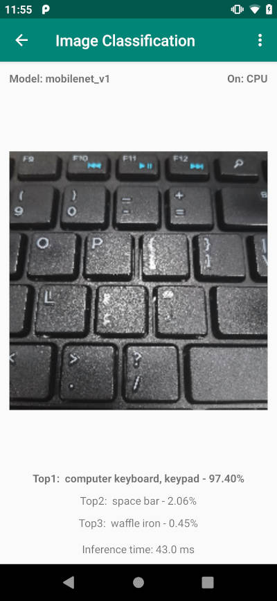
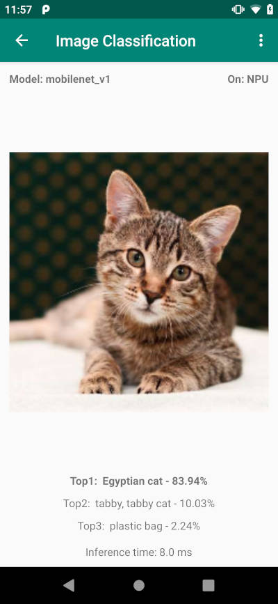
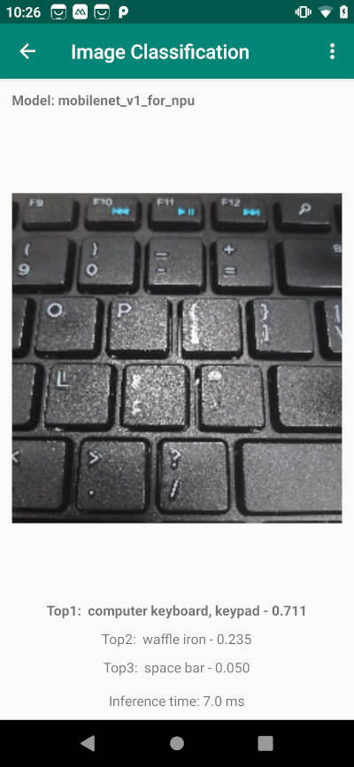

# Paddle-Lite-Demo


## 功能
* iOS示例: 
    * 静态图像目标分类和视频流目标分类；
    * 静态图像目标检测、相机拍照目标检测、相机视频流目标检测;
* Android示例: 基于MobileNetV1的图像分类示例程序；

## 要求

* iOS
    * Mac机器，需要有xcode环境（已验证：Xcode Version 10.1 (10B61)
    * 对于ios 12.x版本，如果提示“xxx.  which may not be supported by this version of Xcode”，请下载对应的[工具包]( https://github.com/iGhibli/iOS-DeviceSupport), 下载完成后解压放到/Applications/Xcode.app/Contents/Developer/Platforms/iPhoneOS.platform/DeviceSupport目录，重启xcode

* Android
    * Android Studio 3.4
    * Android手机或开发版，NPU功能暂时只在麒麟810芯片的华为手机（如Nova5系列）进行了测试，使用前请将EMUI更新到最新版本；
    
    目前，由于NPU暂时需要[full publish so lib](https://github.com/PaddlePaddle/Paddle-Lite/wiki/use_docker_install#%E7%BC%96%E8%AF%91lite)模式下编译的libpaddle_lite_jni.so（相比tiny publish so lib模式下编译的libpaddle_lite_jni.so，文件尺寸会大很多），且需要在当前[PaddleLite源码](https://github.com/PaddlePaddle/Paddle-Lite)基础上做一些额外的修改，因此，建议用户暂时使用本DEMO中自带的libpaddle_lite_jni.so测试NPU功能。与此同时，我们也很快会对tiny publish so模式下编译的libpaddle_lite_jni.so增加NPU的支持，并且和华为合作进一步压缩HIAI so库的大小，向用户提供更加轻量级的so库。
    如果你只想测试CPU的预测能力，且又非常在意so库的大小，建议参考[Paddle Lite源码中自带的DEMO](https://github.com/PaddlePaddle/Paddle-Lite/wiki/demos)完成tiny publish so lib模式下libpaddle_lite_jni.so的编译、自带DEMO的Android工程的导入、编译和测试等工作。


## 安装
$ git clone https://github.com/PaddlePaddle/Paddle-Lite-Demo

* iOS
    * 下载opencv framework, 下载完成后解压到`ios-xxx_demo/xxx_demo/`目录下
    ```bash
    wget https://paddle-inference-dist.bj.bcebos.com/PaddleLiteDemo/opencv2.framework.zip
    ```
    * 打开xcode，点击“Open another project…”打开`Paddle-Lite-Demo/ios-xxx_demo/`目录下的xcode工程；
    * 在选中左上角“project navigator”，选择“classification_demo”，修改“General”信息；
    * 插入ios真机（已验证：iphone8， iphonexr），选择Device为插入的真机；
    * 点击左上角“build and run”按钮；

* Android
    * 打开Android Studio，在"Welcome to Android Studio"窗口点击"Open an existing Android Studio project"，在弹出的路径选择窗口中进入"PaddleLite-android-demo"目录，然后点击右下角的"Open"按钮即可导入工程
    * 通过USB连接Android手机或开发版；
    * 载入工程后，点击菜单栏的Run->Run 'App'按钮，在弹出的"Select Deployment Target"窗口选择已经连接的Android设备，然后点击"OK"按钮；
    * 手机上会出现Demo的主界面，选择第一个"Image Classification"图标，进入基于MobileNetV1的图像分类Demo，注："Object Detection"的Demo正在开发中，请忽略；
    * 在图像分类Demo中，默认会载入一张猫的图像，并会在图像下方给出CPU的预测结果，如果你使用的是麒麟810芯片的华为手机（如Nova5系列），可以通过按下右上角的"NPU"按钮切换成NPU进行预测；
    * 在图像分类Demo中，你还可以通过上方的"Gallery"和"Take Photo"按钮从相册或相机中加载测试图像；

## 更新到最新的预测库
* Paddle-Lite项目：https://github.com/PaddlePaddle/Paddle-Lite
* 参考 [Paddle-Lite文档](https://github.com/PaddlePaddle/Paddle-Lite/wiki)，编译IOS预测库或者Android预测库
* 编译最终产物位于 `build.lite.xxx.xxx.xxx` 下的 `inference_lite_lib.xxx.xxx`
### IOS更新预测库
* 替换库文件：产出的`lib`目录替换`ios-classification_demo/classification_demo/lib`目录
* 替换头文件：产出的`include`目录下的文件替换`ios-classification_demo/classification_demo/paddle_lite`目录下的文件

### Android更新预测库
* 仅支持CPU
  * 替换jar文件：将PaddleLite编译生成的build.lite.android.xxx.gcc/inference_lite_lib.android.xxx/java/jar/PaddlePredictor.jar替换demo中的PaddleLite-android-demo/app/libs/PaddlePredictor.jar
  * 替换arm64-v8a jni库文件：将Paddle-Lite编译生成build.lite.android.armv8.gcc/inference_lite_lib.android.armv8/java/so/libpaddle_lite_jni.so库替换demo中的PaddleLite-android-demo/app/src/main/jniLibs/arm64-v8a/libpaddle_lite_jni.so
  * 替换armeabi-v7a jni库文件：将Paddle-Lite编译生成的build.lite.android.armv7.gcc/inference_lite_lib.android.armv7/java/so/libpaddle_lite_jni.so库替换demo中的PaddleLite-android-demo/app/src/main/jniLibs/armeabi-v7a/libpaddle_lite_jni.so.

  由于当前Android Demo使用了full_publish模式下编译的libpaddle_lite_jni.so库，请使用$ ./lite/tools/build.sh --arm_os=android --arm_abi=armv8 --arm_lang=gcc --android_stl=c++_shared full_publish 命令编译生成arm64-v8a的libpaddle_lite_jni.so，armeabi-v7a的libpaddle_lite_jni.so请将编译命令中的--arm_abi=armv8改为--arm_abi=armv7

  如果对libpaddle_lite_jni.so库大小非常敏感，你可以按照PaddleLite的编译文档在tiny_publish模式下编译生成tiny版libpaddle_lite_jni.so，同时需要修改Predictor.java部分代码，即修改loadModel函数的CxxConfig为MobileConfig，删除NPU模型加载代码，然后将assets目录里面的paddle fluid模型替换为naive buffer模型，建议参考[PaddleLite源码中的内置demo代码](https://github.com/PaddlePaddle/Paddle-Lite/tree/develop/lite/demo/java/android/PaddlePredictor)；

* 支持CPU和NPU
  * 替换jar文件：将PaddleLite编译生成的build.lite.npu.android.xxx.gcc.cxx_shared/inference_lite_lib.android.xxx.npu/java/jar/PaddlePredictor.jar替换demo中的PaddleLite-android-demo/app/libs/PaddlePredictor.jar
  * 替换arm64-v8a jni库文件：将Paddle-Lite编译生成build.lite.npu.android.armv8.gcc.cxx_shared/inference_lite_lib.android.armv8.npu/java/so/libpaddle_lite_jni.so库替换demo中的PaddleLite-android-demo/app/src/main/jniLibs/arm64-v8a/libpaddle_lite_jni.so
  * 替换armeabi-v7a jni库文件：将Paddle-Lite编译生成的build.lite.npu.android.armv7.gcc.cxx_shared/inference_lite_lib.android.armv7.npu/java/so/libpaddle_lite_jni.so库替换demo中的PaddleLite-android-demo/app/src/main/jniLibs/armeabi-v7a/libpaddle_lite_jni.so.

  由于当前Android demo支持NPU需要full_publish模式下编译的libpaddle_lite_jni.so库，且需要在Paddle-Lite源码下使用$ ./lite/tools/build_npu.sh --arm_abi=armv8 full_publish命令编译生成armv64-v8a的libpaddle_lite_jni.so，armeabi-v7a的libpaddle_lite_jni.so请将编译命令中的--arm_abi=armv8改为--arm_abi=armv7，但由于华为最新的DDK库并没有发布，可能无法完成相关编译工作，因此，如果想使用NPU功能，强烈建议使用demo中自带的libpaddle_lite_jni.so和HIAI DDK库；

## 效果展示

* iOS
    * mobilenetv1 目标分类

          

    * mobilenetv1-ssd 目标检测
    
          

* Android
    * CPU预测结果（测试环境：华为nova5）

          

    * NPU预测结果（测试环境：华为nova5）

          
